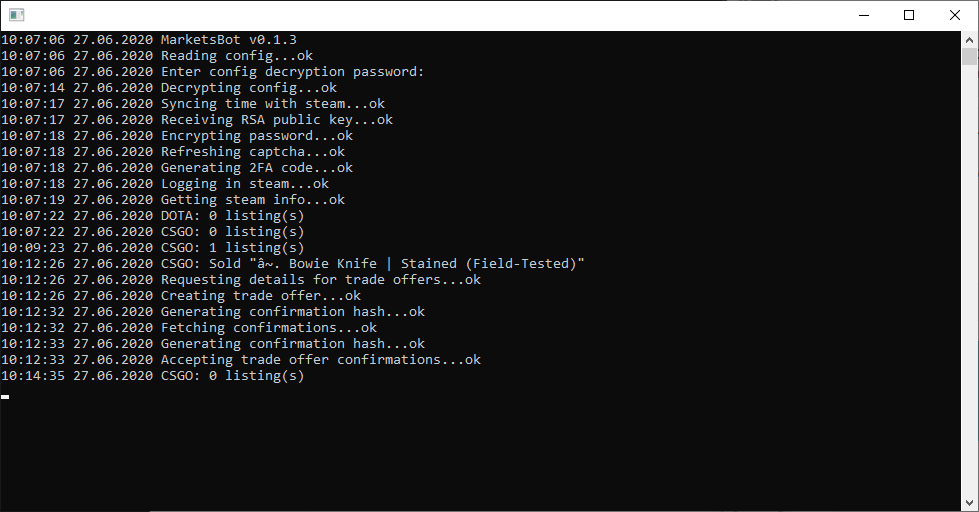

# OpenMarketClient
Unofficial open-source cross-platform console client for:
* [market.csgo.com](https://market.csgo.com)
* [market.dota2.net](https://market.dota2.net)
* [tf2.tm](https://tf2.tm)
* [rust.tm](https://rust.tm)
* [gifts.tm](https://gifts.tm)

# Features
* Multi-account support
* Proxy support
* Sets Steam inventory public, sets API key and trade token on the market
* Keeps your market profile online
* Sends sold items
* Receives bought items
* Accepts Steam Guard confirmations of sent offers
* Cancels unaccepted offers after 15 minutes (required since Steam removed CancelTradeOffer web API)
* Ability to import SteamDesktopAuthenticator's maFile
* Accounts are password encrypted

# Usage
You'll be asked to enter the encryption password which will be used to encrypt and decrypt saved accounts.

## Entering details manually
If you don't have any accounts added you'll be asked to enter new account automatically, otherwise launch the program with "--new" command line option.

## Importing SDA's maFile
Put SDA's unencrypted maFile into "accounts" folder (create it if you don't have it) and the program will import most details automatically.

## Required details
* Market API key ([you can get one here](https://market.csgo.com/docs-v2))
* Steam username
* Steam password

*and those Steam Guard Mobile Authenticator details*
* Two factor code
* Identity secret

You can read how to extract them from your phone [here](https://github.com/JustArchiNET/ArchiSteamFarm/wiki/Two-factor-authentication#android-phone).

## Command line options
* --new - Enter new account manually
* --proxy [scheme://][username:password@]host[:port] - Set global proxy

# Build requirements
* C++17 supporting compiler
* libcurl
* wolfSSL
* RapidJSON
